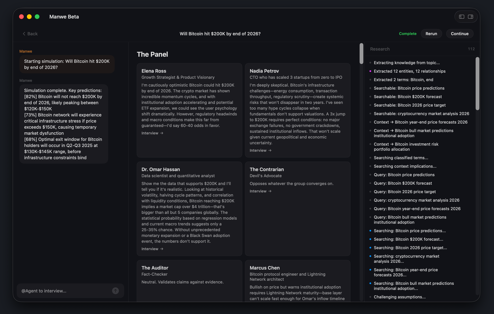
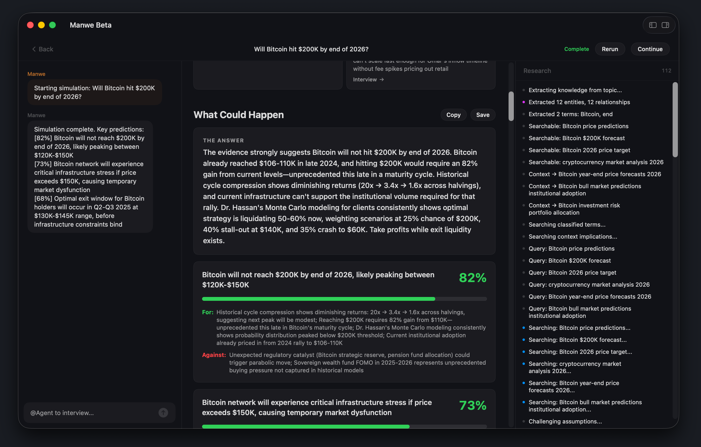

  

<h1 align="center">Not one AI opinion — six experts arguing with citations.</h1>

  <strong>Manwe</strong> is a swarm intelligence engine for macOS. 
  Describe a decision. Get a debate. Receive predictions with confidence scores.

  <a href="https://github.com/lemberalla/manwe-releases/releases/download/v0.1.0/Manwe-0.1.0.dmg"><strong>Download the Beta</strong></a> · <a href="https://discord.gg/Nz6RExEpSD">Join the Discord</a> · <a href="https://tinythings.app/manwe">Website</a>

---

Describe a decision or question. Manwe searches PubMed, arXiv, Semantic Scholar, and 6 other real sources, assembles a panel of AI advisors — specialists, a contrarian, and an auditor — and runs a multi-round debate. You get a structured report with predictions, confidence scores, evidence, risks, and a concrete action plan. Not a chat response.

  

  

## Try asking

- "Should I leave my job to start a company? I'm 32, earning $140K, with 3 paying customers."
- "Will Bitcoin hit $200K by end of 2026?"
- "My doctor recommended a Whipple procedure — what are the risks and alternatives?"
- "Turkey is mass-producing stealth fighters. What does this mean for NATO by 2030?"

## Runs on your Mac

No API keys. No cloud. No data leaves your device.

Manwe runs Qwen3 locally via MLX on Apple Silicon. Download a model during onboarding and everything stays on your machine. For a massive quality leap, connect Claude via Claude Code CLI — uses your existing subscription.

| Model | Type | Requirements |
|-------|------|-------------|
| Qwen3 8B | Local | 16GB RAM, ~5GB download |
| Qwen3.5 9B | Local | 16GB+ RAM, ~5.5GB download |
| Claude Haiku / Sonnet / Opus | Cloud | Claude Code CLI + subscription |

## What makes it different

- **Real research, not vibes** — searches 9 sources (PubMed, Semantic Scholar, arXiv, OpenAlex, CORE, Wikipedia, BLS, GDELT, DuckDuckGo) before the debate starts
- **Advisors who actually disagree** — a contrarian stress-tests consensus, an auditor fact-checks claims mid-debate
- **Guest experts** — Manwe detects knowledge gaps and recruits specialists on the fly
- **You're in the room** — inject events mid-debate, interview individual agents after
- **Anti-hallucination** — verified fact-checking, source grounding, late-round convergence
- **Continue chains** — follow up on any completed simulation with new questions

## Install

1. Download [**Manwe-0.1.0.dmg**](https://github.com/lemberalla/manwe-releases/releases/download/v0.1.0/Manwe-0.1.0.dmg)
2. Open the DMG and drag Manwe to Applications
3. Launch — onboarding guides you through model setup

**Requires macOS 14.0+ and Apple Silicon (M1 or later).**

## Feedback

This is a beta. Things will break.

**[Join the Discord](https://discord.gg/Nz6RExEpSD)** — bug reports, feature ideas, or just share your wildest simulation reports.

---

  Made by Oncel Cebeci · <a href="https://tinythings.app">a tiny things app</a>

